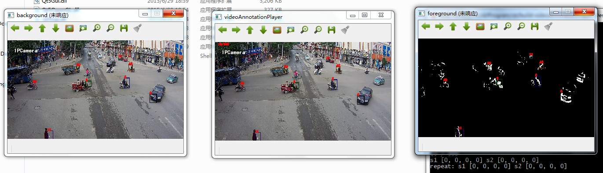

#videoAnnotationPlayer
###language
- opencv
- sqlite
- qt

###input
- videoName.avi
- videoName.sqlite
- config.ini
- [videoName-foreground]
- [videoName-background]

###output
- foreground annotation
- background annotation
- videoPlay annotation



###file dir tree
~~~mermaid
graph LR;
a(targetDir)-->b(videoName.avi);
a-->videoName.sqlite;
a-->d(videoName-foreground);
a-->e(videoName-background);

x(workspaceDir)-->videoAnnotationPlayer.exe;
x-->config.ini
~~~

###config.ini
```
[foreground]
#show foreground or not
show=true

[background]
#show background or not
show=true

[videoPlay]
#show=true
save=true
frameNum=100
```